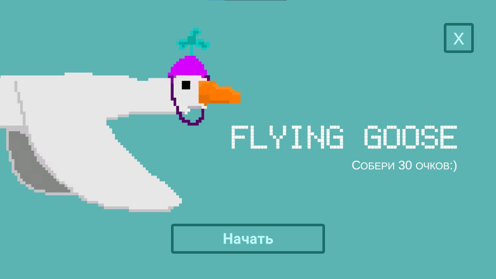
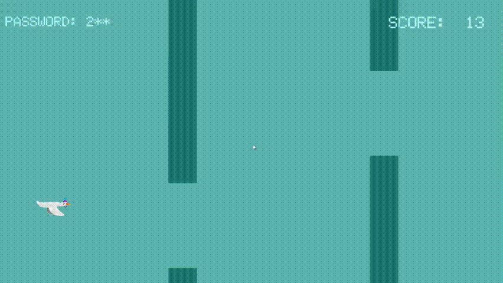

# Flying Goose
## О приложении

Игра Flying Goose - адаптация популярной игры Flappy bird, выполненная мною на игровом движке Unity в 2023 году. К сожалению исходный код был утерян, но у меня остался финальный билд игры, в который можно поиграть
## Запуск приложения
Для того что бы самостоятельно поиграть в игру:
1. Зайдите во вкладку с релизами проекта на гитхабе
2. Скачайте от туда zip-файл с названием игры
3. Распакуйте этот zip-файл
4. Откройте папку
5. Запустите игру дважды кликнув на ярлык с именем игры
## Интерфейс и Управление
После запуска проекта, вы попадаете в меню. В меню две кнопки:
+ Кнопка начать - запускает игровой процесс
+ Кнопка с крестиком - закрывает игру

Игровой процесс показан на гифке ниже.
+ Колоны генерируются случайно. 
+ За каждый пролет колонны вы получаете +1 к счету. Чем больше счет, тем быстрее игра.

Управление:
+ Прыжок совершается при нажатии левой кнопки мыши, или же пробела
+ При столкновении с колонной нажмите R что бы начать заного, или же ESC для выхода в меню   

